# Rosie HQ

## Introduction

Create an app that maintains a database of all current and previous Rosies. The app has the ability to list all, search one, update and delete. There is also a chat room for any Rosies to catch up or discuss coding issues.

## Technology

* Our team plans to use PostgreSQL, Express and React. We also will implement using Bootstrap, JSX and at least two tables.
* Our plan to implement the difficult parts is to google the crap out of it, utilize each other as a resource and then send up a hail mary to our buddies and/or a teacher.

* **Additional packages**
  * [psqlJS](https://www.npmjs.com/package/psqljs) - a more readable way to write psql queries

## MVP

1.  We must have a SPA home page with links to index and chat.
1.	We must have an index page that lists all the Rosies.
1.	We must have an option to add a Rosie from the index page.
1.	We must have a link on the index page to each Rosie.
1.	We must have a page to show each Rosie.
1.	We must have an option to update or delete each Rosie from the individual Rosie page.
1.  We must have two tables - Rosies and People Managers
1.  We must have a chat page with sockets.

## Goals

1.	We would like to utilize the Disney Rostr API.
1.	We would like to have an archived Rosie page.
1.	We would like to have a Rosie projects page and associated table including links to all projects.

## Stretch Goals

1.	We would love to add a comments section to the projects page.
1.	We would love to add a way to create and resolve an issue on the projects page.
1.  We would love to save the chats to a database.

## Timeline

* Friday night
  - Git clone and branch
  - Create R for home page, rosie index and rosie show (client and server)
  - Create initial socket stuff

* Tuesday night
  - Create C, U and D
  - Complete sockets

* Wednesday night
  - Bootstrap/CSS
  - Initial deploy on Heroku

* Thursday night
  - Complete deploy on Heroku
  - Add some Goals
  - Add some stretch goals

## Struggles

1.	Socket persistence.
1.	Adjusting links to maintain SPA.
1.  Using multiple tables/routes on one page.
1.  Git merge conflicts.

## APP

* Link to our app: https://enigmatic-bayou-70301.herokuapp.com/
* Screen shots:
  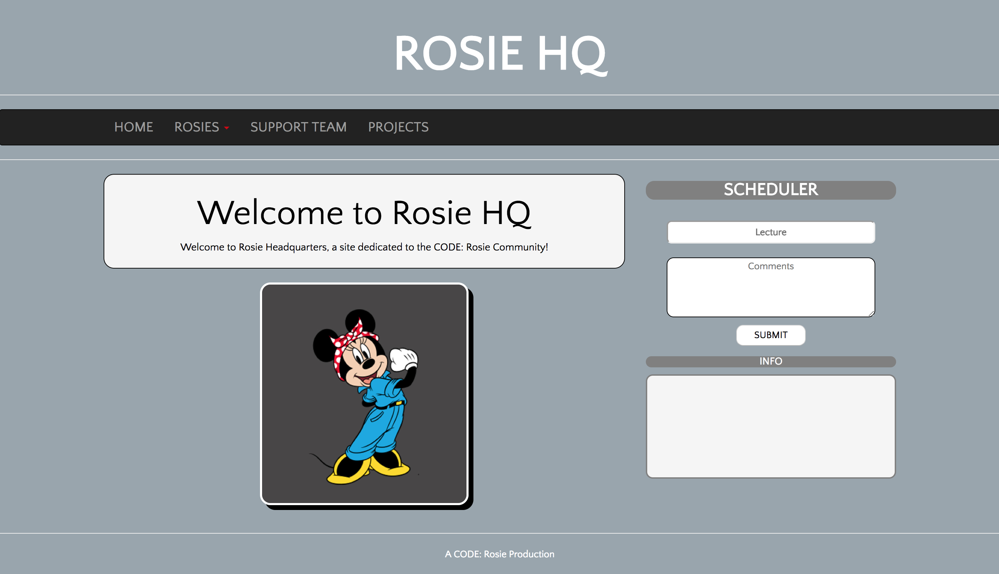
  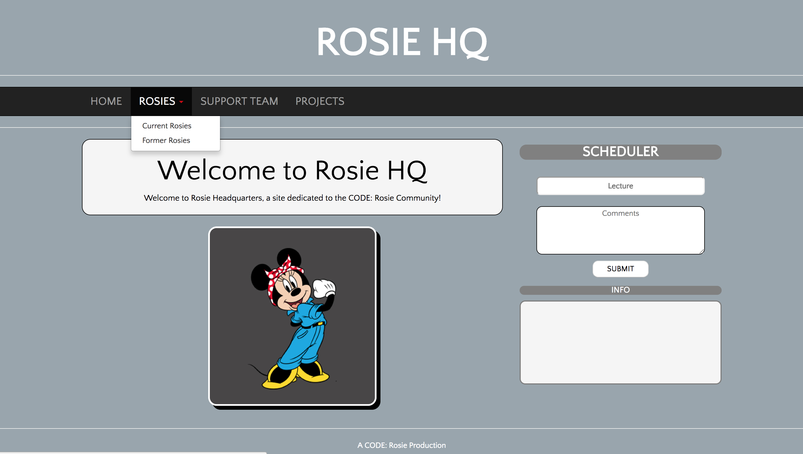
  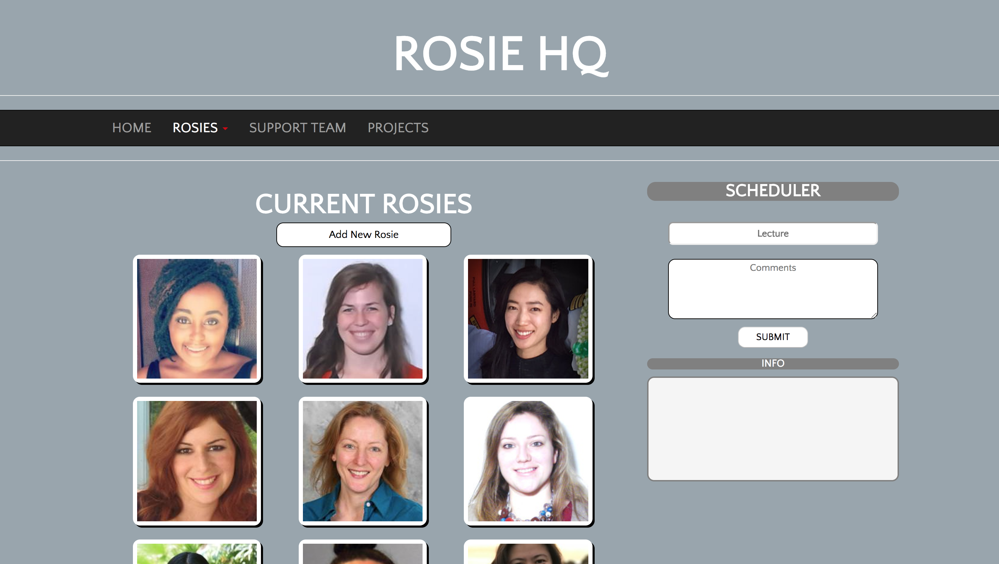
  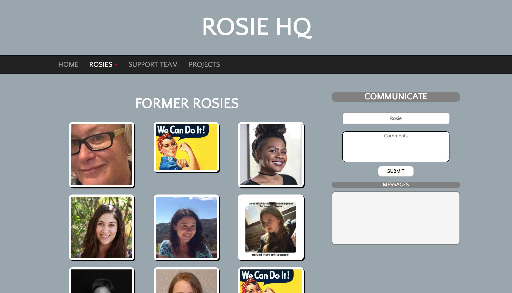
  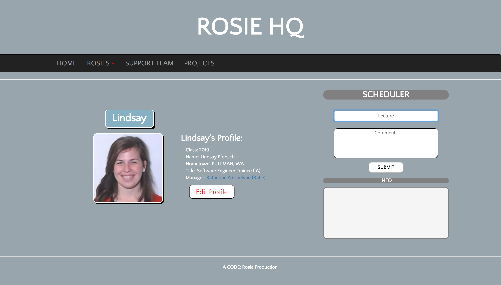
  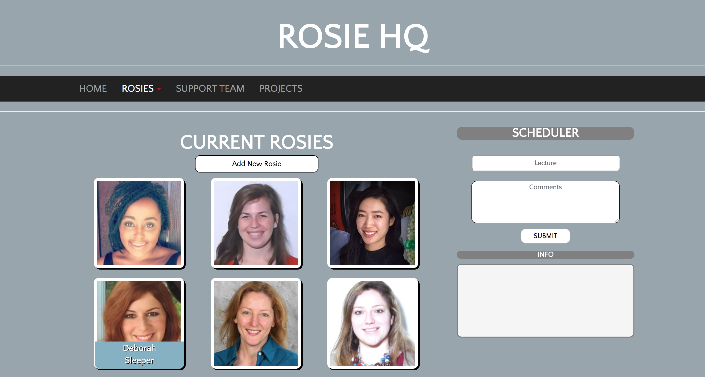
  
  
  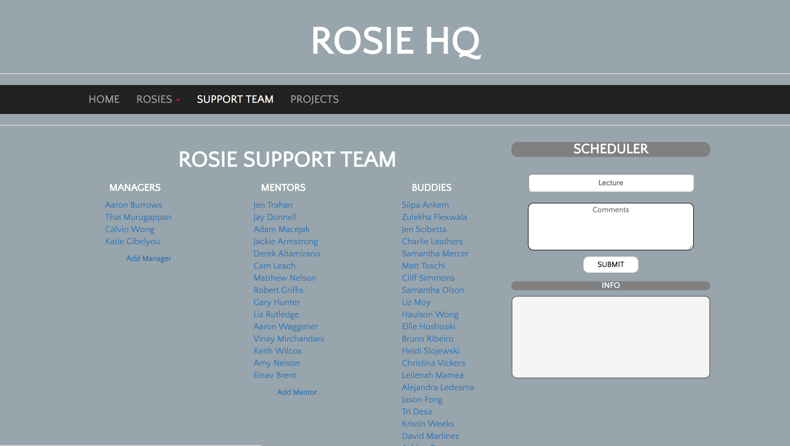
  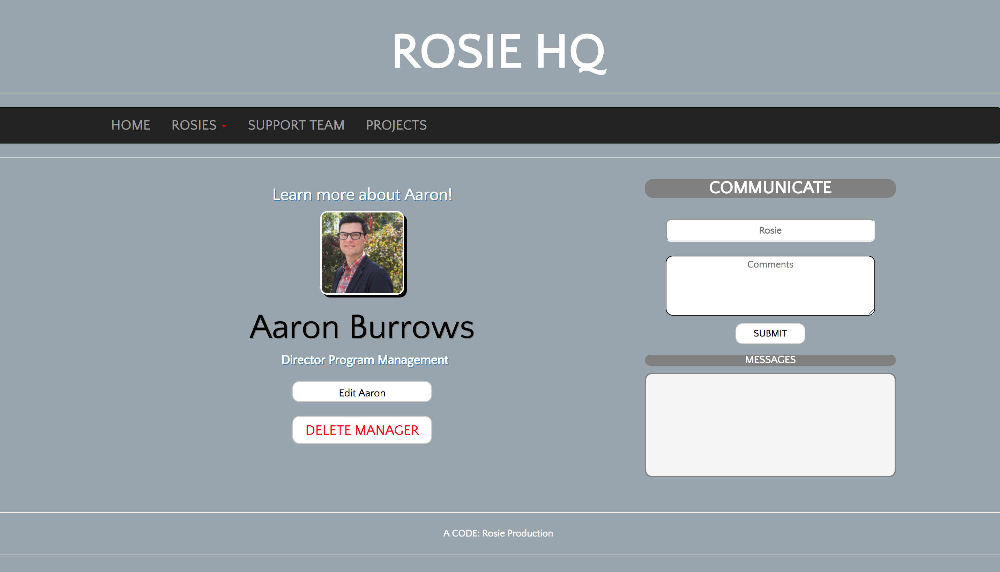
  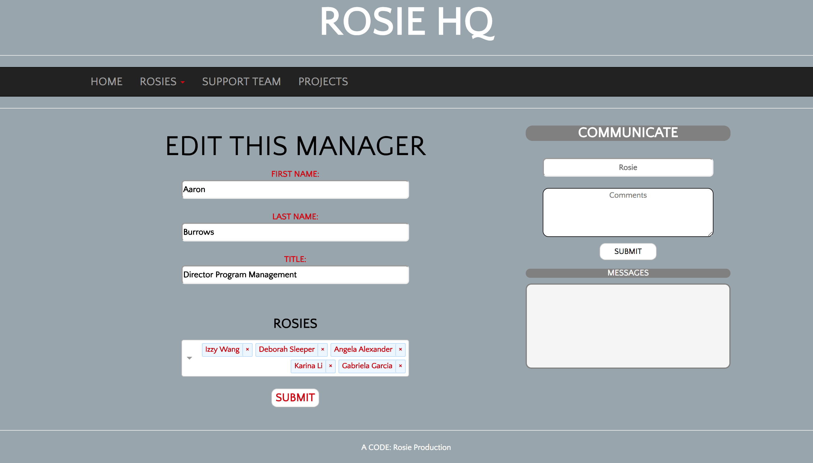
  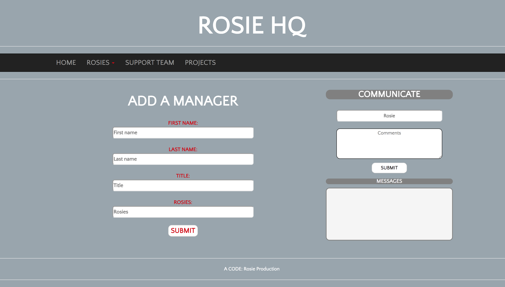
  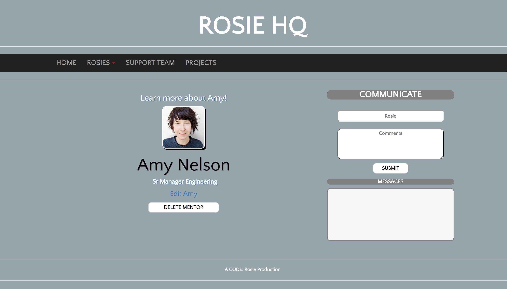
  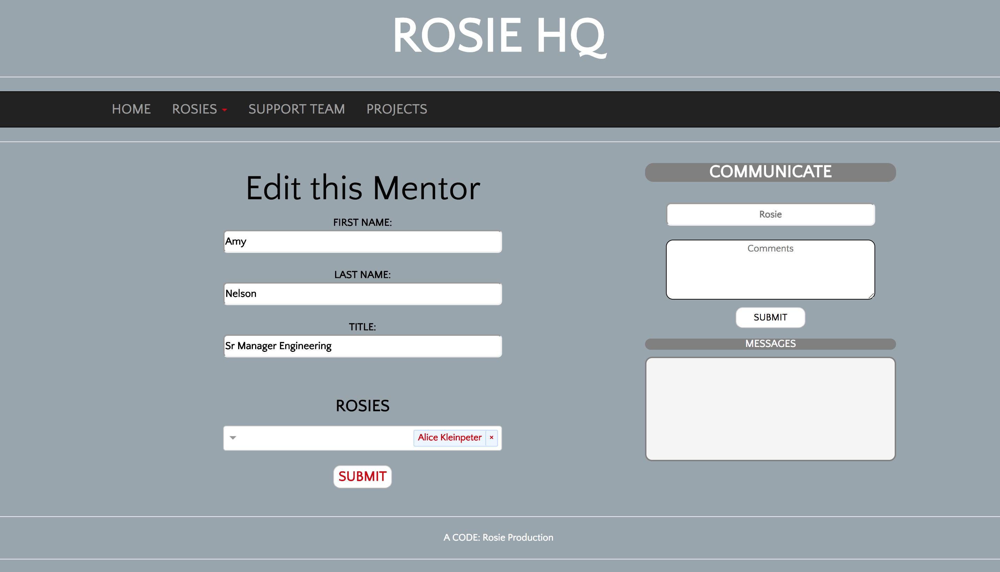
  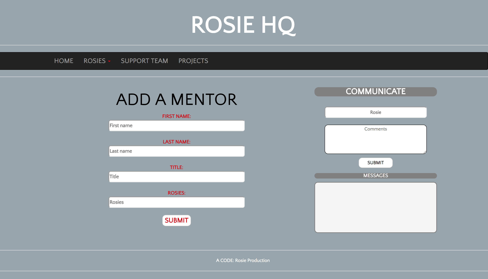
  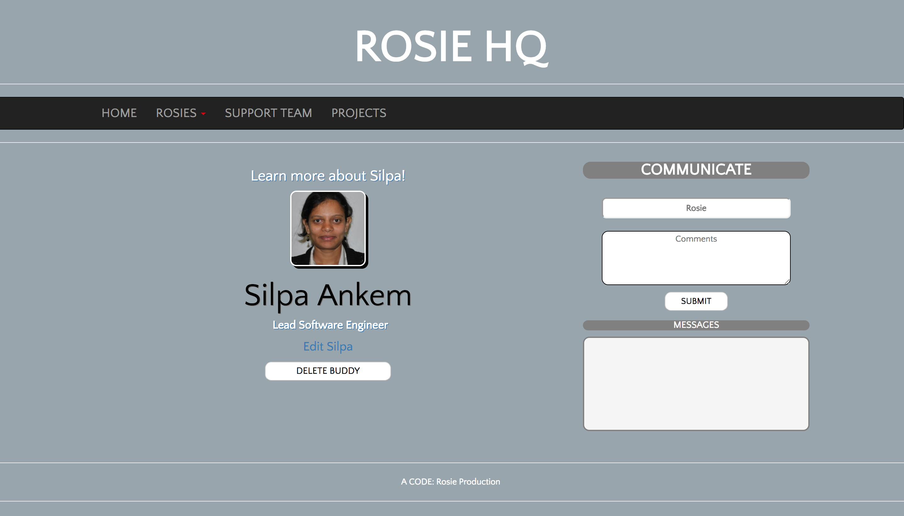
  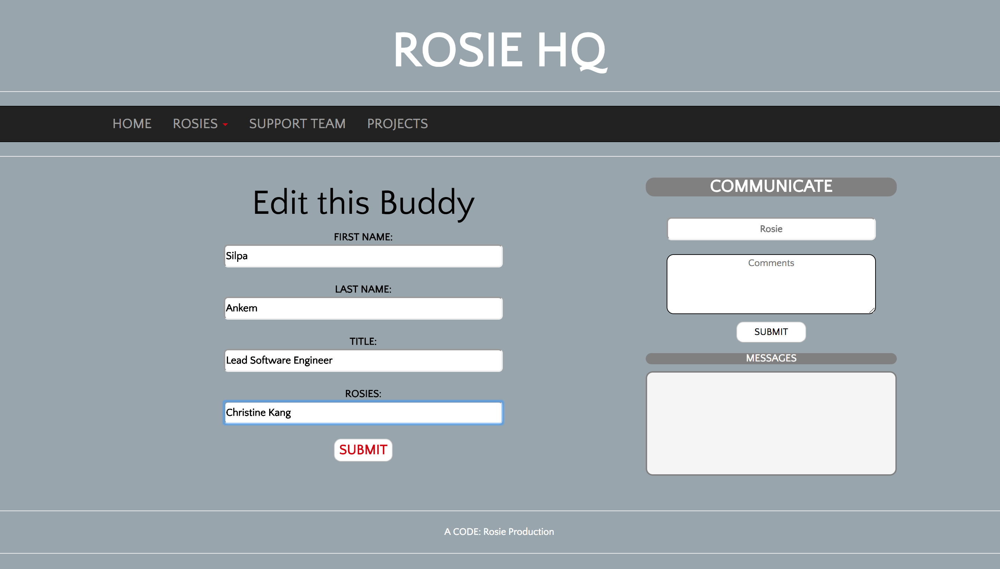
  
  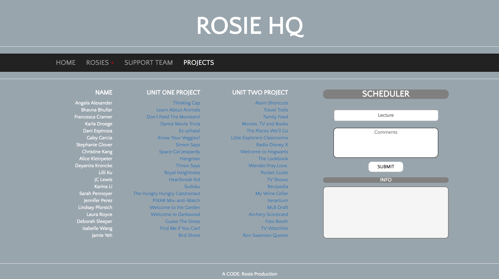

## Future Goals

1. Directly link to Rostr for photos.
1. Link each support team person to their rosie and each rosie to all their support team members.
1. Add a schedule to sockets that saves each day and the ability to scroll between pages.
1. Add projects table and project links on each rosie page.
